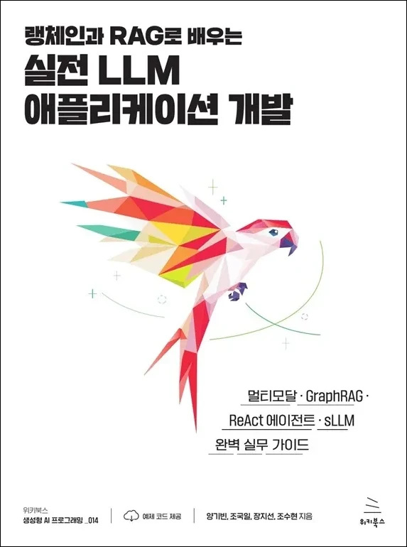

# D2506_LangChain_RAG
랭체인과 라그를 활용한 LLM Application 개발

### 멀티모달/GraphRAG/ReAct 에이전트/sLLM 완벽 실무 가이드
<table>
    <tr>
        <td>
            
        </td>
        <td>
<li> ISBN: 9791158395988
<li> 판형: 175\*235\*16mm
<li> 28,000원 | 2025년 4월 10일 발행 | 300쪽
        </td>
    </tr>
</table>

- ISBN: 9791158395988
- 판형: 175\*235\*16mm
- 28,000원 | 2025년 4월 10일 발행 | 300쪽
---

**LLM 애플리케이션, 이제는 실전으로!**

**>> Why pay attention at this point?**

언어 모델이 강력해질수록 사용자에게는 새로운 도전이 생긴다. 
- 외부 데이터 및 지식을 어떻게 연결할 것인가? 
- 복잡한 워크플로를 어떻게 구성할 것인가? 
- 모델의 환각 현상을 어떻게 제어할 것인가? 
이런 질문에 답하며 랭체인과 RAG 기술로 현실적인 문제를 해결하는 방법을 안내한다.

**>> Core Skills**

- 랭체인의 필수 컴포넌트(체인, 메모리, 도구, 에이전트)부터 다양한 RAG 방법론(리트리버, 리랭커, 하이브리드 검색, 멀티모달 처리, GraphRAG, ReAct 패턴, sLLM 활용)까지 체계적으로 다룬다. 
- 단순한 API 호출을 넘어 RAG 방법론의 진화 과정과 적용 시나리오를 이해하고, 코랩 환경에서 바로 실행할 수 있는 코드로 구성
- 특히 상황별로 어떤 접근법이 적합한지 명확한 가이드라인과 실제 서비스로 확장할 수 있는 아키텍처 패턴을 제시한다.
