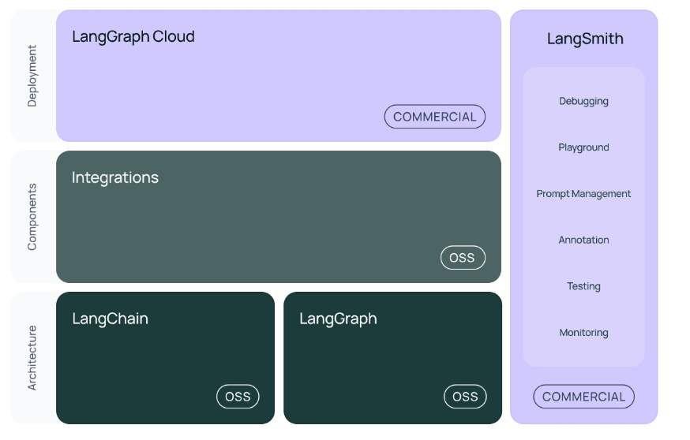

[practical_llm]: readme.md
[][practical_llm]

### INDEX

<table>
  <tr align="center">
    <td width="150px"><b href="sect_01.md"> [LangChain]        </b></td>
    <td width="150px"><a href="sect_02.md"> [RAG]              </a></td>
    <td width="180px"><a href="sect_03.md"> [Multimodal RAG]   </a></td>
    <td width="150px"><a href="sect_04.md"> [Graph RAG]        </a></td>
    <td width="150px"><a href="sect_05.md"> [ReAct Agent]      </a></td>
    <td width="150px"><a href="sect_06.md"> [sLLM]             </a></td>
  </tr>
</table>

---
## 1. 랭체인(LangChain)  

대규모 언어 모델(LLM)을 활용한 애플리케이션 개발을 돕는 `오픈소스 프레임워크`  
다양한 데이터를 활용하여 `맥락에 맞는 응답`을 제공할 수 있는 환경을 제공 <b**r/>

- 기존 언어 모델이 단순한 텍스트 생성에 머무르는 경우가 많지만, LangChain은 **외부 데이터 소스와 통합**하여 보다 복잡하고 유용한 애플리케이션을 만들 수 있도록 설계되었다.
- 이 프레임워크는 데이터베이스, API, 파일 시스템 등과 연결하여 **실시간 데이터를 활용**할 수 있도록 지원하며, 이를 통해 챗봇, 문서 분석, 코드 생성, 질문 응답 시스템 등 다양한 AI 애플리케이션을 구축할 수 있다. 
- 또한, 프롬프트 관리, 체인 구성, 에이전트 활용 등의 기능을 제공하여 개발자가 보다 **정교한 AI 시스템**을 만들 수 있도록 도와준다.
- 쉽게 말해, LangChain은 LLM을 단순한 텍스트 생성 도구가 아니라 **실제 애플리케이션과 연결**하여 더 강력한 기능을 수행할 수 있도록 하는 도구라고 볼 수 있다.
 

### LangChain의 기본 프레임워크
_LangChain은 기본적으로 간소화된 LLM 애플리케이션 라이프사이클을 제공하며, 다음과 같은 `오픈소스 라이브러리로 구성`합니다._

- **개발**: LangChain의 오픈소스 빌딩 블록, 컴포넌트, 서드파티 통합 등을 사용하여 애플리케이션을 빌드합니다. 
• langchain: 애플리케이션의 코그너티브 아키텍처를 구성하는 체인, 에이전트 및 검색 전략 
• langchain-core: 기본 추상화 및 LangChain 표현 언어 
• langchain-community: 서드파티 통합 (langchain-openai, langchain-anthropic 등) 

- **테스트**: LangSmith를 사용하여 체인을 검사, 모니터링 및 평가합니다. 
• LangSmith: LLM 애플리케이션을 디버깅, 테스트, 평가, 모니터링할 수 있는 개발자 플랫폼입니다. 

- **배포**: LangGraph Cloud를 사용하여 LangGraph 애플리케이션을 프로덕션에 바로 사용할 수 있는 API와 Assistant로 전환합니다. 
• LangGraph: 그래프의 에지와 노드로 단계를 모델링하여 LLM으로 견고한 “stateful” 멀티 액터 애플리케이션을 구축합니다. 
• LangServe: LangChain 체인을 REST API로 배포합니다. 
 

**랭체인 기본 프레임웍**

 

[[TOP]](#index)

---
### LangChain의 주요 기능

- **다양한 데이터 소스와의 통합**  
• LangChain은 다양한 데이터 소스와의 원활한 통합을 지원하는 강력한 기능을 제공합니다.  
• 이를 통해 데이터베이스, API, 파일 시스템 등 다양한 소스의 데이터를 실시간으로 활용할 수 있습니다.  
• 이러한 통합은 사용자에게 더욱 정확하고 관련성 높은 정보를 제공하는 데 필수적이며, 애플리케이션이 복잡한 데이터를 실시간으로 처리하고 활용할 수 있게 합니다.  
• 예를 들어, 금융 서비스에서 실시간 시장 데이터를 분석하거나, 의료 분야에서 환자 기록을 즉각적으로 조회하고 분석하는 애플리케이션을 구축할 수 있습니다.

- **유연한 프롬프팅 및 컨텍스트 관리**  
• LangChain은 LLM을 효과적으로 활용하기 위한 유연한 프롬프팅과 컨텍스트 관리 도구를 제공합니다.  
• 이러한 도구는 언어 모델이 사용자 질문에 대해 더욱 정확하고 맞춤형 응답을 생성할 수 있도록 돕습니다.  
• 프롬프팅 기능은 사용자와의 대화를 보다 자연스럽고 연속성 있게 만들어주며, 복잡한 대화 흐름에서도 일관된 컨텍스트를 유지할 수 있게 합니다.  
• 이를 통해 고객 지원 챗봇이나 인터랙티브한 학습 도우미와 같은 애플리케이션에서 사용자 경험을 크게 향상할 수 있습니다.

- **파인튜닝 및 커스터마이징**  
• LangChain은 특정 작업에 맞춘 언어 모델을 구축하기 위해 파인튜닝과 커스터마이징 기능을 제공합니다.  
• 이 기능은 사용자가 특정 비즈니스 요구에 맞는 모델을 세밀하게 조정할 수 있도록 도와줍니다.  
• 예를 들어, 특정 산업의 전문 용어를 이해하고 그에 따라 응답을 생성하도록 언어 모델을 파인튜닝할 수 있습니다.  
• 또한, LangChain은 다양한 모델을 쉽게 교체하거나 조정할 수 있는 유연성을 제공하므로, 애플리케이션의 요구에 맞춰 모델을 최적화할 수 있습니다.

- **데이터 반응형 애플리케이션 구축**  
• LangChain은 실시간 데이터와 상호작용하는 데이터 반응형 애플리케이션을 구축할 수 있는 기능을 제공합니다.  
• 이러한 애플리케이션은 사용자가 입력한 정보를 즉각적으로 처리하고, 그에 따라 실시간으로 반응하는 시스템을 구현할 수 있게 해줍니다.  
• 예를 들어, 실시간 시장 변화에 따라 자동으로 투자 전략을 조정하는 금융 애플리케이션이나, 사용자 입력에 기반해 실시간으로 맞춤형 학습 콘텐츠를 제공하는 교육 플랫폼을 개발할 수 있습니다.

 

[[TOP]](#index)

---
### LangChain의 장점과 단점

LangChain은 강력하고 유연한 도구로, 다양한 언어 모델과의 통합을 통해 복잡한 애플리케이션을 구축하는 데 매우 유용합니다.  
그러나 성능 최적화 및 학습 곡선의 문제와 같은 단점도 존재하므로, 이를 고려하여 프로젝트에 적합한 도구인지 판단하는 것이 중요합니다.  

**LangChain의 장점**   
LangChain은 다양한 언어 모델과 쉽게 통합할 수 있으며, 이를 통해 복잡하고 다양한 애플리케이션을 구축할 수 있습니다. 이 프레임워크는 OpenAI의 GPT-4나 Hugging Face 모델과 같은 대규모 언어 모델과 원활하게 통합되어, 사용자가 필요에 따라 모델을 확장하고 조정할 수 있는 높은 확장성을 제공합니다. 이는 특히 다양한 데이터 소스와의 통합을 통해 애플리케이션이 여러 복잡한 작업을 수행할 수 있게 해줍니다.

LangChain은 프롬프팅, 컨텍스트 관리, 파인튜닝 등 다양한 기능을 제공하여 사용자가 필요에 따라 애플리케이션의 동작을 세밀하게 조정할 수 있는 높은 유연성을 자랑합니다. 이러한 유연성은 다양한 산업 분야에서 맞춤형 솔루션을 구현하는 데 중요한 역할을 합니다. 또한, LangChain은 여러 언어 모델과의 통합이 가능하여, 다양한 사용 사례에 맞춘 애플리케이션을 쉽게 구축할 수 있습니다.

LangChain은 활발한 오픈소스 커뮤니티에서 지원을 받고 있습니다. 이 커뮤니티는 지속적인 업데이트와 개선을 통해 LangChain의 기능을 확장하고, 다양한 문제 해결에 도움을 줍니다. 또한, 개발자들이 서로의 경험을 공유하고, 문제를 해결하는 데 큰 도움이 되는 다양한 리소스를 제공받을 수 있습니다. 커뮤니티의 지원 덕분에 LangChain은 빠르게 성장하고 있으며, 개발자들이 최신 기술을 활용할 수 있도록 돕습니다.

**LangChain의 단점**   
LangChain은 매우 복잡한 애플리케이션을 구축할 때 성능 저하가 발생할 수 있습니다. 특히, 대규모 데이터 소스를 처리하거나 실시간 응답을 요구하는 애플리케이션의 경우, 성능 최적화가 필요할 수 있습니다. 이는 LangChain이 다수의 외부 데이터 소스와 통합되면서 발생하는 추가적인 연산 부담 때문이며, 성능을 높이기 위해 추가적인 하드웨어 리소스나 코드 최적화가 필요할 수 있습니다.

LangChain을 처음 사용하는 개발자들에게는 이 프레임워크가 다소 복잡하게 느껴질 수 있습니다. 특히, 다양한 기능과 옵션을 활용하기 위해서는 일정한 학습 시간이 필요하며, 이를 효과적으로 사용하기 위해서는 깊이 있는 이해가 요구됩니다. 이로 인해 초보자나 작은 프로젝트를 진행하는 개발자들에게는 부담이 될 수 있습니다.

LangChain은 특정 사용 사례에 적합하도록 설계되었지만, 모든 상황에 완벽하게 맞는 것은 아닙니다. 예를 들어, 특정 산업에서 요구하는 고도로 특화된 기능이 LangChain에서 기본적으로 제공되지 않을 수 있으며, 이를 구현하기 위해서는 추가적인 커스터마이징이 필요할 수 있습니다. 또한, 일부 사용 사례에서는 성능, 비용, 복잡도 등의 이유로 다른 솔루션이 더 적합할 수도 있습니다.

 

[[TOP]](#index)

---