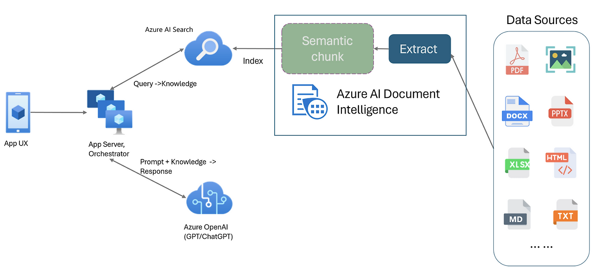

[practical_llm]: readme.md
[][practical_llm]

### INDEX

<table>
  <tr align="center">
    <td width="150px"><a href="sect_01.md"> [LangChain]        </a></td>
    <td width="150px"><b href="sect_02.md"> [RAG]              </b></td>
    <td width="180px"><a href="sect_03.md"> [Multimodal RAG]   </a></td>
    <td width="150px"><a href="sect_04.md"> [Graph RAG]        </a></td>
    <td width="150px"><a href="sect_05.md"> [ReAct Agent]      </a></td>
    <td width="150px"><a href="sect_06.md"> [sLLM]             </a></td>
  </tr>
</table>

---
## 2. RAG(Retrieval-Augmented Generation)

---
**RAG(Retrieval-Augmented Generation)** 은 검색 증강 생성 기술로, 대규모 언어 모델(LLM)의 한계를 보완하기 위해 개발되었습니다.  
기존 LLM은 학습된 데이터만을 기반으로 응답을 생성하지만, RAG는 외부 데이터베이스에서 관련 정보를 검색한 후 이를 활용하여 더욱 정확한 응답을 생성하는 방식입니다  
 

 

### RAG의 기본 아키텍처

일반적인 RAG 파이프라인은 두 개의 주요 컴포넌트로 구성됩니다:  

- **검색기(Retriever)**  
• 사용자 쿼리에 따라 관련 문서를 외부에서 검색해오는 역할을 합니다.  
• 기존의 BM25와 같은 기호 기반 검색 방식이 아닌, Dense Embedding을 사용한 근사 최근접 이웃(ANN) 검색이 활용 
• 사용자의 질문을 벡터화하여 데이터베이스에서 관련 문서를 검색  
• 대표적인 벡터 데이터베이스로는 FAISS, Pinecone, Weaviate, Chroma 등이 있습니다.
- **생성기(Generator)**  
• 검색된 문서와 사용자 쿼리를 입력으로 받아 최종 응답을 생성하는 대규모 언어 모델입니다.  
• 기존 LLM보다 더 신뢰성 높은 정보를 제공할 수 있음  
• (예: GPT, T5, FLAN, Gemini)  
 

RAG의 기본 구조는 다음과 같습니다:
<pre>
사용자 쿼리 → Dense Retriever → 상위 k개 문서 → LLM Generator → 최종 응답
</pre>

 

[[TOP]](#index)

---
### 컴포넌트 상세 설명

1. 벡터 저장소 / 벡터 데이터베이스  
벡터 데이터베이스는 문서의 임베딩을 저장하고 인덱싱하는 역할을 수행합니다.   
주요 솔루션은 다음과 같습니다:  

- **FAISS**    : Facebook AI에서 개발한 고속 ANN 검색 엔진.
- **Pinecone** : 클라우드 기반의 완전 관리형 벡터 DB 서비스.
- **Weaviate** : 스키마 기반 필터링과 하이브리드 검색을 지원하는 벡터 DB.
- **Chroma**   : 오픈소스 기반의 경량 벡터 DB로 LangChain과 잘 통합됩니다.

이러한 시스템은 문서 단위 텍스트를 임베딩하여 저장하고, 쿼리 임베딩과의 코사인 유사도 또는 내적을 기반으로 문서를 검색합니다.  
 

2. 임베딩 모델  
문서 및 쿼리를 Dense Vector로 변환하는 모델입니다.   
주요 모델은 다음과 같습니다:  

- **Sentence-BERT (SBERT)**
- **OpenAI text-embedding-ada**
- **Instructor-XL** 및 기타 크로스도메인 모델
 

3. 검색 알고리즘  
벡터 DB에서 사용하는 근사 최근접 이웃 검색 방식은 다음과 같습니다:  

- HNSW (Hierarchical Navigable Small World)
- IVF (Inverted File Index)
- ScaNN, Annoy, Pinecone 및 Milvus의 독자적 알고리즘
 

4. RAG 생성기 모델  
RAG에서 사용되는 생성 모델은 다음과 같습니다:  

- **BART**     : Facebook AI의 원래 RAG 논문에서 사용됨.
- **GPT 계열** : GPT-3.5, GPT-4 등.
- **T5**       : 인코더-디코더 구조를 가지며 FiD(Fusion-in-Decoder) 방식에 주로 사용됩니다.
 

[[TOP]](#index)

---
### RAG 구현 방식의 종류

| 종류 | 설명 |
|------|-----|
| **Vanilla RAG**         | 상위 k개 문서를 LLM 입력에 단순 연결하여 응답 생성.        |
| **RAG-Token**           | 각 토큰 생성 시 특정 문서에 기반한 생성.                  |
| **FiD(Fusion-in-Decoder)** | 문서들을 별도로 인코딩하고 디코더에서 결합.            |
| **Multi-hop RAG**        | 다단계 문서 검색 및 추론 수행.                          |
| **LangChain 기반 RAG**    | 체인 방식으로 RAG를 구성하고 조건 분기, 메모리 등을 제어.  |
| **Haystack, LlamaIndex** | 파이프라인 전체를 관리하는 오픈소스 기반 RAG 프레임워크.   |

 

[[TOP]](#index)

---
### RAG의 장단점

**RAG의 장점** 
- **사실성 향상**  : 최신 외부 데이터를 참조함으로써 환각(hallucination) 감소.
- **비용 효율성**  : 소형 LLM과 정밀한 검색기를 조합하여 대형 모델보다 뛰어난 결과 도출 가능.
- **도메인 적응성** : LLM 재학습 없이도 새로운 지식 기반에 빠르게 적응 가능.
- **투명성**       : 검색된 문서를 함께 제공하여 생성 근거 제공 가능.

**RAG의 단점**  
- **검색 품질 의존**   : 검색이 부정확하면 생성 결과도 저하됨.
- **지연 시간**       : 검색 → 생성의 2단계 파이프라인은 실시간 서비스에 부적합할 수 있음.
- **토큰 한계**       : 많은 문서를 연결하면 입력 한도를 초과할 수 있음.
- **엔지니어링 복잡성** : 검색기, 생성기, 벡터 DB, 파이프라인 등 관리 요소 증가.
 

[[TOP]](#index)

---
 

[[TOP]](#index)

---